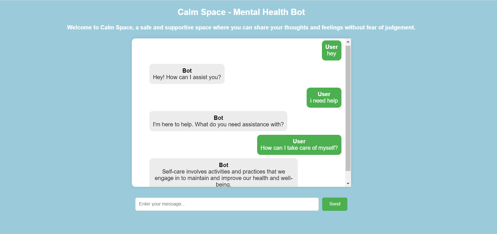

# Calm Space - Mental Health Chatbot

## Overview
Calm Space is a mental health chatbot designed to provide support and resources for users. The chatbot can respond to user inquiries related to mental health topics using a pre-trained model and can be easily deployed using Flask for the backend and HTML,CSS,JavaScript for the frontend.

## Features
User Interaction: Users can send messages to the chatbot and receive responses based on the trained model.
Mental Health Support: The bot is designed to handle various intents related to mental health, including anxiety, depression, self-care, and more.
Real-time Messaging: Messages are displayed in a chat interface, with user and bot messages aligned on the same line for clear conversation flow.

## Installation

Python 3.x 
Flask 
Keras (for model loading and prediction) 
NLTK (for text processing) 
Other dependencies listed in requirements.txt 

## Usage
Open your web browser and navigate to http://127.0.0.1:5000/. 
Type a message into the input field and click "Send." 
The chatbot will respond based on the trained model and display responses in the chat interface. 

## Code Structure
app.py: Flask backend handling routes and integrating with the chatbot model. 
static/js/bot.js: JavaScript file managing chat interactions and user input. 
static/js/bot.js: JavaScript file managing chat interactions and user input. 
templates/index.html: HTML file providing the chat interface. 

## Contact
For any questions or feedback, please reach out to nehaannie2002@gmail.com
